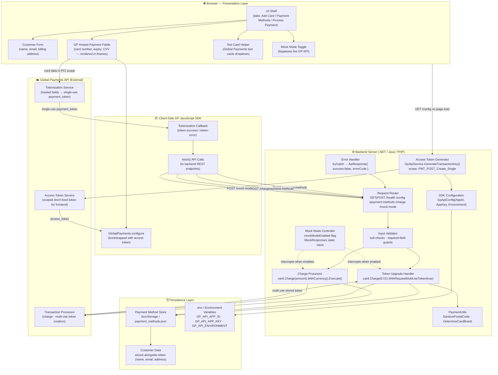
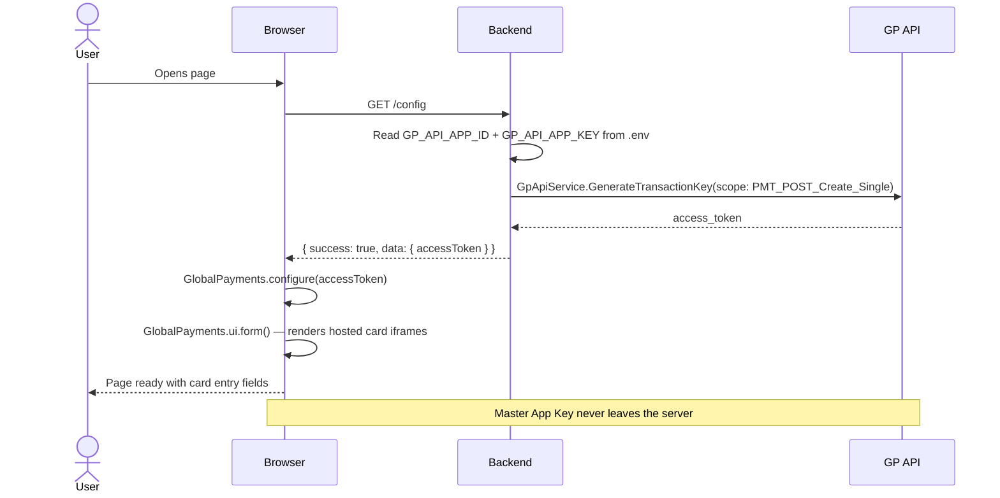
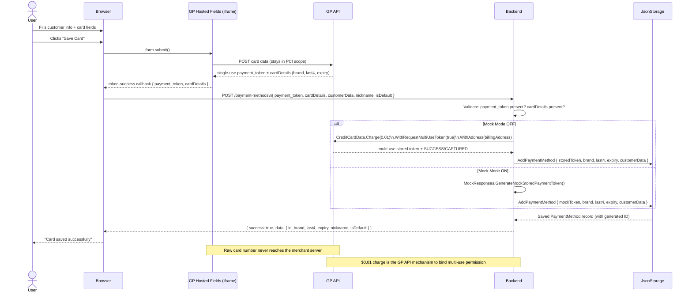
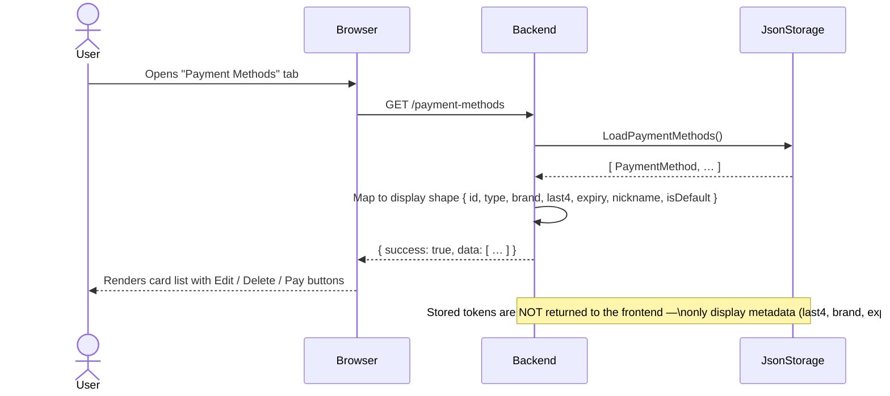
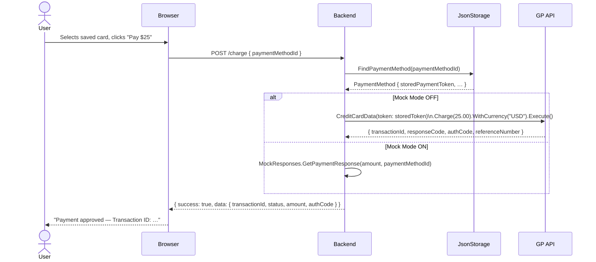
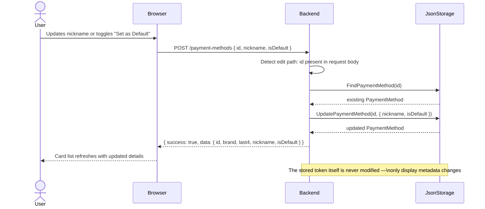
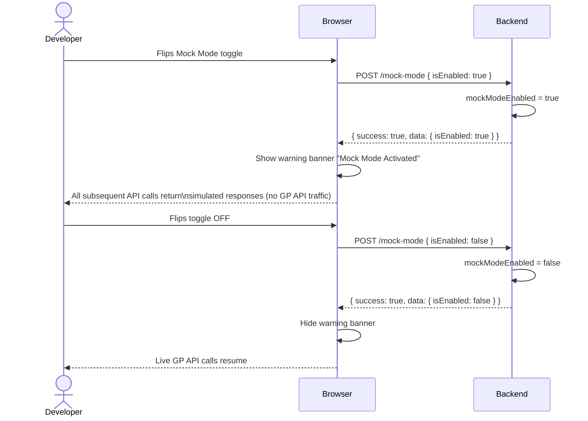

# Architecture Documentation — Save and Reuse Payment Methods

**Purpose:** Demonstrates how to securely capture a card once, convert it to a reusable stored token, and then process one-click charges against it — across PHP, Java, and .NET backends.

**Repository:** `save-and-reuse-payment-methods`

**Language implementations:** PHP · Java · .NET (ASP.NET Core)

---

## Component Architecture Diagram

---

## Component Catalog

| # | Layer | Component | File(s) | What it does | Why it exists |
|---|---|---|---|---|---|
| 1 | Presentation | **UI Shell** | `wwwroot/index.html` | Three-tab layout: Add Card, Payment Methods, Process Payment | Gives users a structured journey matching the three core operations |
| 2 | Presentation | **Customer Form** | `index.html` — `#add-card-form` | Collects first/last name, email, phone, billing address | Customer identity must travel with the token so it can be attached to transactions for reporting and chargebacks |
| 3 | Presentation | **GP Hosted Payment Fields** | `index.html` — `GlobalPayments.ui.form(...)` | Renders card number, expiry, and CVV fields inside GP-hosted iframes | Card data is captured directly by GP's servers; the merchant's page never touches raw card numbers, eliminating PCI SAQ-D scope |
| 4 | Presentation | **Test Card Helper** | `index.html` — `#test-card-select` | Dropdown of six Global Payments test cards (Visa, MC, Discover, Amex, JCB) | Lets developers exercise different card brands in sandbox without needing real cards |
| 5 | Presentation | **Mock Mode Toggle** | `index.html` — `#mock-mode-checkbox` | Sends `POST /mock-mode` to flip a server-side flag; shows a warning banner | Allows complete UI demos without live GP API credentials or network access |
| 6 | Client SDK | **GP JS SDK / Configure** | `index.html` — `GlobalPayments.configure(accessToken)` | Bootstraps the hosted-fields library with the short-lived frontend access token | The SDK needs a scoped token (not the master App Key) so it can talk to GP's tokenization service on behalf of the browser |
| 7 | Client SDK | **Tokenization Callback** | `index.html` — `card.on('token-success', ...)` | Receives `payment_token` and `cardDetails` after the user submits card data | The single-use token is the only artefact that leaves the hosted fields; this is the handoff point to the merchant's own code |
| 8 | Client SDK | **fetch API Calls** | `index.html` — multiple `fetch(...)` | POST to `/payment-methods`, GET `/payment-methods`, POST `/charge`, POST `/mock-mode` | Drives all backend interactions from the frontend using the standard Fetch API |
| 9 | Backend | **SDK Configuration** | `Program.cs` — `ConfigureGlobalPaymentsSDK()` | Reads App ID, App Key, and environment from env vars; calls `ServicesContainer.ConfigureService(config)` | Must happen once at startup so every subsequent SDK call is pre-authenticated |
| 10 | Backend | **Access Token Generator** | `Program.cs` — `GET /config` | Calls `GpApiService.GenerateTransactionKey(config)` with `PMT_POST_Create_Single` permission | The frontend needs a short-lived, narrowly scoped token — not the master credentials — to initialise the hosted fields safely |
| 11 | Backend | **Request Router / Endpoints** | `Program.cs` — `ConfigureEndpoints()` | Declares all REST routes: `/health`, `/config`, `/payment-methods`, `/charge`, `/mock-mode` | Provides a consistent, language-agnostic REST surface identical across PHP, Java, and .NET |
| 12 | Backend | **Input Validator** | `Program.cs` — null/empty checks before SDK calls | Guards required fields (`payment_token`, `cardDetails`, `paymentMethodId`) and returns `400 VALIDATION_ERROR` | Prevents malformed inputs from reaching the GP SDK and producing confusing SDK-level exceptions |
| 13 | Backend | **Token Upgrade Handler** | `Program.cs` — `HandleCreatePaymentMethodMultiUse()` + `PaymentUtils.CreateMultiUseTokenWithCustomerAsync()` | Wraps the single-use token in a `CreditCardData`, calls `.Charge(0.01).WithRequestMultiUseToken(true)` with the customer address | GP API requires an executed transaction to bind multi-use permission to a token; the $0.01 charge is the mechanism for that conversion |
| 14 | Backend | **Charge Processor** | `Program.cs` — `ProcessPayment()` | Looks up the stored `PaymentMethod`, uses its token in `card.Charge(amount).Execute()` | One-click payment: the stored multi-use token stands in for the card, so the customer never needs to re-enter card data |
| 15 | Backend | **Mock Mode Controller** | `Program.cs` — `mockModeEnabled` + `MockResponses.cs` | When enabled, bypasses all GP SDK calls and returns synthetic approval/decline responses | Enables demos and automated tests without consuming live API quota or requiring credentials |
| 16 | Backend | **Error Handler** | `Program.cs` — try/catch blocks throughout | Catches all exceptions and maps them to the standard `ApiResponse<T>` envelope with `success: false` | Guarantees the frontend always receives a predictable shape — never a raw 500 stack trace |
| 17 | Backend | **PaymentUtils** | `PaymentUtils.cs` | `SanitizePostalCode()` strips non-alphanumeric characters; `DetermineCardBrandFromType()` maps GP card type strings to display names | Isolates reusable, SDK-adjacent helper logic from route handlers |
| 18 | Persistence | **Payment Method Store** | `JsonStorage.cs` → `data/payment_methods.json` | CRUD operations (load, save, add, update, delete, find) over a JSON file | Lightweight persistence suitable for demos; real implementations would use a database with encrypted token storage |
| 19 | Persistence | **Customer Data Store** | `Models.cs` — `CustomerData` embedded in `PaymentMethod` | Stores name, email, phone, and billing address alongside each token | Required for receipts, dispute handling, and address verification on future charges |
| 20 | Persistence | **Credential Store** | `.env` / OS environment variables | Holds `GP_API_APP_ID`, `GP_API_APP_KEY`, `GP_API_ENVIRONMENT` | Follows the Twelve-Factor App principle: secrets never hard-coded or committed to source control |
| 21 | External | **GP Tokenization Service** | GP API (hosted fields infrastructure) | Receives raw card data from the iframe, returns a short-lived `payment_token` | Moves card data entirely outside the merchant's PCI scope |
| 22 | External | **GP Access Token Service** | GP API OAuth endpoint | Issues a scoped front-end token from App ID + App Key | Allows the browser to use GP services without ever seeing the master API key |
| 23 | External | **GP Transaction Processor** | GP API | Processes the $0.01 token-upgrade charge and all subsequent `Charge()` calls | The authoritative record of every transaction; returns `transactionId`, `authCode`, `referenceNumber` |

---

## Process Flows

### F1 — Page Load & SDK Initialisation

When the browser loads the page, it must obtain a short-lived access token from the server before the hosted payment fields can render. This keeps the master API credentials on the server.

---

### F2 — Save a New Payment Method

The most complex flow. Card data is captured by GP-hosted fields (never touching the server), a single-use token is produced, then the server converts that to a reusable multi-use token via a $0.01 charge.

---

### F3 — List Saved Payment Methods

---

### F4 — Process a Charge (One-Click Payment)

---

### F5 — Edit Payment Method Metadata

---

### F6 — Mock Mode Toggle

---

## Key Architectural Decisions

| Decision | Reason |
|---|---|
| **Hosted payment fields (iframes) for card capture** | Card data never passes through the merchant server, eliminating PCI DSS SAQ-D scope. The merchant only ever sees a tokenised reference. |
| **Short-lived frontend access token (`PMT_POST_Create_Single` scope)** | The master App Key must never be exposed in browser JavaScript. A scoped token limits what an attacker could do if they intercepted it — it can only create single-use tokens, nothing else. |
| **$0.01 charge to upgrade single-use → multi-use token** | GP API enforces that multi-use token binding requires a successful transaction. The small charge is the prescribed mechanism; it proves the card is valid and active at time of storage. |
| **Stored token never returned to the frontend** | `GET /payment-methods` returns only display metadata (brand, last4, expiry, nickname). The token stays server-side, preventing client-side exfiltration. |
| **Identical REST surface across PHP / Java / .NET** | The same frontend HTML works against any backend language. Developers can switch implementations without changing a single line of frontend code. |
| **JSON file storage instead of a database** | Keeps the sample dependency-free and runnable with a single command. A production implementation should use a database with encrypted token storage and tokenisation vault policies. |
| **Mock Mode as a server-side flag** | Synthetic responses are generated server-side so the UI/UX flow is identical whether live or mocked. This makes demos reliable and reproducible in environments without API credentials. |
| **`ApiResponse<T>` envelope on all endpoints** | Every response has the same outer shape (`success`, `data`, `message`, `timestamp`, `errorCode`). Frontend code can handle errors uniformly without inspecting status codes alone. |

---

## Error Scenarios

| Scenario | Where it's handled | Response |
|---|---|---|
| Missing `payment_token` in save request | Backend validator in `POST /payment-methods` | `400 VALIDATION_ERROR` — "Missing required payment_token" |
| Missing `cardDetails` in save request | Backend validator in `POST /payment-methods` | `400 VALIDATION_ERROR` — "Missing required cardDetails" |
| `paymentMethodId` not found at charge time | `JsonStorage.FindPaymentMethodAsync()` | `400 PAYMENT_FAILED` — "Payment method not found" |
| GP API credentials not configured | `ConfigureGlobalPaymentsSDK()` — caught, server keeps running | Server falls back to Mock Mode for that request |
| GP API multi-use token creation failure | `PaymentUtils.CreateMultiUseTokenWithCustomerAsync()` — caught | Falls back to Mock Mode for that request; surface error is logged |
| Invalid JSON body | `JsonSerializer.Deserialize` failure | `400 VALIDATION_ERROR` — "Invalid JSON format" |
| `/config` endpoint fails to generate access token | `GET /config` handler catch block | `500 CONFIG_ERROR` — frontend shows token generation error |
| Tokenization failure in hosted fields | `card.on('token-error', ...)` in browser | Error rendered in the UI card form; no backend call is made |
